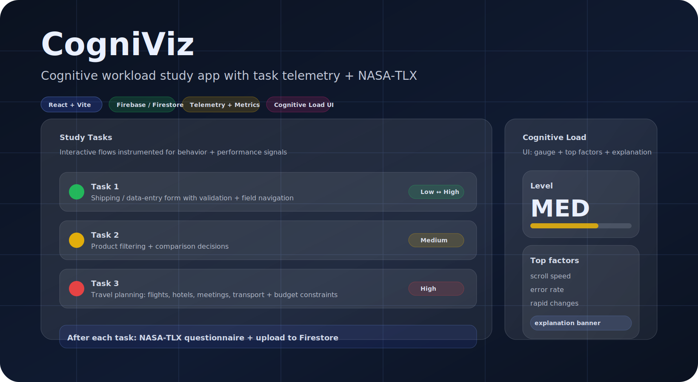

# CogniViz

<div align="center">




**A browser-native research system for cognitive workload instrumentation and NASA-TLX collections**

[🚀 Quick Start](#-quick-start) | [✨ Features](#-features) | [🧪 Study Flow](#-study-flow) | [📦 Project Structure](#-project-structure) | [🔒 Security Notes](#-security-notes)

</div>

---

## 🌟 Overview

**CogniViz** is a browser-native study application designed to support **sensor-free cognitive load research** by pairing **high-resolution behavioral interaction telemetry** with **subjective workload assessment** via **NASA-TLX**.

It implements the data-collection and experimental execution layer of the CogniViz research framework, enabling:

- Controlled task execution  
- Fine-grained behavioral logging  
- Consistent workload self-report  
- Structured data aggregation  
- Secure study artifact storage  

The system is designed to support **participant-independent modeling**, **interpretable feature engineering**, and **reproducible cognitive workload inference**.

---

## 🎯 Purpose & Scope

CogniViz is not a generic analytics dashboard.  
It is a **research-grade instrumentation and study execution system**.

It is designed to:

- Instrument **natural interaction behavior**  
  (mouse, keyboard, form edits, hesitations, drag attempts, navigation)  
- Capture **task-level and subtask-level workload**  
  using NASA-TLX after each task  
- Produce **structured, schema-consistent study artifacts**  
  suitable for downstream modeling and explainable ML  
- Enable **real-time cognitive load visualization**  
  for demonstration, validation, and human-centered adaptation studies  

---

## 🧠 Research Framing

CogniViz operationalizes cognitive load as a **dynamic interaction phenomenon**, not a static task label.

The system supports this framing by:

- Logging **breakdown–repair dynamics**  
  (errors, corrections, retries, idle bursts)  
- Capturing **planning and conflict behavior**  
  (drag failures, constraint violations, repeated rescheduling)  
- Recording **multitasking and hesitation patterns**  
  (panel switching, hover oscillations, idle time)  
- Pairing telemetry with **subjective workload ground truth**  
  (NASA-TLX per task)

This design enables both:

- Participant-independent ML inference  
- Post-hoc interpretability analysis  
- Explanation-driven UI adaptation  

---

## ✨ Features

### 🧪 Study Workflow

- **Consent-first routing** with task progression gating  
- **Three instrumented tasks**:
  - Task 1 — Shipping / data entry form  
  - Task 2 — Product exploration and filtering  
  - Task 3 — Multi-constraint travel planning  
- **NASA-TLX questionnaire modal** after each task  
- **Completion page** that aggregates all telemetry and questionnaire data  
- Secure upload of structured study artifacts to **Firebase Firestore**  
- Built-in **de-duplication** to prevent multiple uploads per participant  

---

### 📈 Behavioral Telemetry Collection

- Task-specific logging hooks:
  - `useTask1Logger`  
  - `useTask2Logger`  
  - `useTask3Logger`  
- Structured JSON event streams written to `localStorage`  
- Unified aggregator builds a single **study response document**  
- Optional export of:
  - Raw JSON  
  - CSV artifacts  

This pipeline is designed for:

- Feature engineering  
- Cross-task normalization  
- Participant-independent modeling  

---

### 🧠 Cognitive Load UI (Demo + Task Integration)

CogniViz includes an integrated, real-time cognitive load UI for:

- Visualization  
- Validation  
- Demonstration  
- Explanation-driven adaptation  

Components:

- `CognitiveLoadContext`  
  - Shared state:
    - `loadLevel`  
    - `metrics`  
    - `topFactors`  
    - `explanation`  
    - `mode`  

- UI primitives:
  - `CognitiveLoadGauge`  
  - `ExplanationBanner`  
  - `TopFactorsList`  

- Demo route:
  - `/cognitive-demo`  

This layer mirrors the runtime structure of the CogniViz inference system described in the research paper.

---

## 🚀 Quick Start

### Prerequisites

- Node.js + npm  
  (recommended: modern LTS)

---

### Run the frontend

```bash
npm install
npm run dev
```

Then open the printed local URL (typically `http://localhost:5173`).

### Optional: configure a backend proxy target

The dev server proxies these routes:
- `/ws/metrics`
- `/health`
- `/predict`

Configure the backend target URL with:

```bash
export VITE_DEV_BACKEND_URL="http://localhost:8000"
npm run dev
```

If no backend is running:
- The app operates in a frontend-only mode
- Telemetry WebSocket calls are stubbed
- The cognitive load UI remains functional for demo purposes

---

## 🧪 Study Flow

1. Consent and instructions
2. **Task 1** — Shipping / data entry form
3. **NASA-TLX** questionnaire
4. **Task 2** — Product exploration and filtering
5. **NASA-TLX** questionnaire
6. **Task 3** — Travel planning
   - Budget
   - Flights
   - Hotels
   - Meetings
   - Transport
7. **NASA-TLX** questionnaire
8. Completion page
   - Aggregate telemetry
   - Aggregate NASA-TLX
   - Upload structured study artifact to Firestore

### Documentation References

Logged metrics and schemas:
- `STUDY_METRICS_DOCUMENTATION.md`

Cognitive load UI design and control logic:
- `COGNITIVE_LOAD_IMPLEMENTATION.md`

---

## 📦 Project Structure

```text
.
├── index.html
├── package.json
├── vite.config.js
├── public/
├── assets/
│   └── dashboard.svg
├── scripts/
│   └── task3_smoke_test.js
├── src/
│   ├── App.jsx
│   ├── main.jsx
│   ├── pages/
│   │   ├── ConsentLanding.jsx
│   │   ├── Task1.jsx
│   │   ├── Task2.jsx
│   │   ├── Task3.jsx
│   │   ├── CognitiveLoadDemo.jsx
│   │   └── CompletionPage.jsx
│   ├── hooks/
│   │   ├── useTask1Logger.js
│   │   ├── useTask2Logger.js
│   │   └── useTask3Logger.js
│   ├── contexts/
│   │   ├── AuthContext.jsx
│   │   ├── TaskProgressContext.jsx
│   │   └── CognitiveLoadContext.jsx
│   ├── components/
│   │   ├── CognitiveLoadGauge.jsx
│   │   ├── ExplanationBanner.jsx
│   │   ├── TopFactorsList.jsx
│   │   └── ...
│   ├── telemetry/
│   │   ├── taskMetricsBus.js
│   │   ├── metricsWorker.js
│   │   └── wsClient.js
│   └── utils/
│       ├── firebase.js
│       ├── dataCollection.js
│       └── tlx.js
└── backend/
    └── FEATURE_ORDER.json
```

---

## 🧪 Testing

### UI Smoke Test (Task 3)

This repository includes a Puppeteer smoke test for Task 3.

1) Start the dev server:

```bash
npm run dev
```

2) In a second terminal:

```bash
node scripts/task3_smoke_test.js
```

This test validates:
- Route loading
- Core interaction flows
- Basic telemetry integrity

---

## 🔒 Security Notes

- **Do not commit real service-account credentials.**  
  If using `firebase-admin`, keep service-account JSON keys out of version control.

- **The Firebase client configuration is not secret.**  
  Firestore security rules and Auth configuration determine write permissions.

- **If uploads fail with permission errors:**
  - Enable Anonymous Auth, or
  - Adjust Firestore rules to allow `create` on the target collection.

---

## 📄 License

No license is currently specified in this repository.  
If you plan to distribute or publish this code, add a `LICENSE` file and update this section.

---

## 🧭 Research Note

CogniViz is a research instrumentation and demonstration system, not a production analytics platform.

If you deploy it in real studies:

- Provide explicit consent text
- Perform a privacy and data governance review
- Obtain IRB or equivalent ethics approval
- Enforce secure storage and retention policies

---

<div align="center">

[⬆ Back to Top](#cogniviz)

</div>

</div> ```
